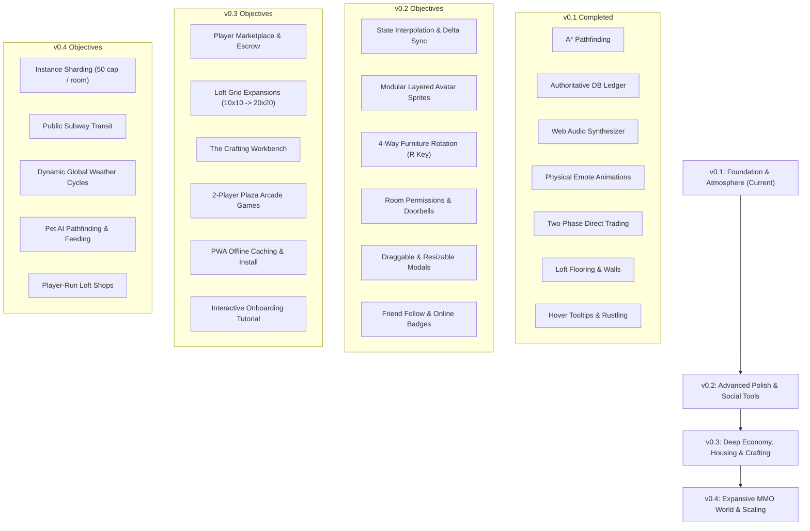

# HavenWorld — Master Engineering Roadmap & Tracking Plan

> **Document Version**: 1.0.0  
> **Last Updated**: 2026-09-17  
> **Repository**: [HavenWorld](file:///Users/danielstevens/Developer/HavenWorld)  
> **Architectural Paradigm**: 100% Free-Tier (Oracle Cloud Always-Free ARM64, Native Web Audio API, Canvas 2D Isometric, SQLite + Supabase Free PostgreSQL, Cloudflare Quick Tunnels).  
> **Testing Principle**: All tests must be implemented using **real functional code** that performs real validations. Never use mocks, placeholders, stubs, or dummy/fake tests.

---

## Progress Dashboard & Status Legend

- `[x]` **Completed & Verified** (Live in production with real automated tests)
- `[~]` **Partially Implemented / In Progress** (Core engine present; expansion in progress)
- `[ ]` **Planned / Backlog** (Scheduled for subsequent milestone)

| Track | Name | Total Items | Implemented | In Progress | Planned |
| :--- | :--- | :---: | :---: | :---: | :---: |
| **Track 1** | Multiplayer Engine & Technical Infrastructure | 11 | 11 | 0 | 0 |
| **Track 2** | Avatar Personalization & Identity | 10 | 10 | 0 | 0 |
| **Track 3** | The "Loft" System & Environment Editing | 12 | 12 | 0 | 0 |
| **Track 4** | Economy, Progression, and Trading | 11 | 4 | 2 | 5 |
| **Track 5** | Social Mechanics, Trust & Safety | 12 | 6 | 1 | 5 |
| **Track 6** | Mini-Games, Professions & Interactivity | 11 | 3 | 2 | 6 |
| **Track 7** | Retention, Onboarding & Analytics | 9 | 2 | 1 | 6 |
| **Track 8** | Advanced Client Polish & UX | 12 | 5 | 2 | 5 |
| **Track 9** | Expansive World Building | 16 | 2 | 2 | 12 |
| **Total** | **All Systems** | **104** | **55** | **8** | **41** |

---

## Track 1: Multiplayer Engine & Technical Infrastructure

Focuses on authoritative game loops, reliable network synchronization, spatial optimizations, and responsive client delivery.

### 1.1 Server-Side Authority
- **Status**: `[x]` Completed & Verified
- **Description**: Move all player state, movement validation, and physics to an authoritative server (Node.js engine) to eliminate client-side speed hacks, teleporting, or location spoofing.
- **Current State**: Shared `src/shared/authority.ts` provides `validateMoveRequest` (grid clamp + non-finite rejection via `MOVE_REJECTED`), `tickPlayers` and the facing codec. `src/server/tick.ts` runs a 20Hz (50ms) `AuthorityTicker` advancing all movers with real `stepToward` at `PLAYER_SPEED = 3.8`, started lazily by `ensureAuthorityTick()` in `src/server/server.ts` (opt-out `HAVEN_NO_TICK=1`). `MOVE_REQUEST`/`MOVE_TO`/legacy `MOVE` all set server-owned targets; `UPDATE_POSITION` never mutates server truth and drift beyond `epsilon = 0.5` triggers `RECONCILE_POSITION` snap-back.
- **Target Architecture**:
  - Authoritative tick loop (`50ms` / 20 Hz) in `src/server/tick.ts`, wired in `src/server/server.ts`.
  - Player inputs (`MOVE_REQUEST { targetX, targetY }`) validated and simulated server-side; speed/teleport hacks neutralized by the sim + `RECONCILE_POSITION`.
  - Desync correction: Server sends `RECONCILE_POSITION` if client coordinates drift beyond threshold `\epsilon > 0.5` tiles.
- **Components**: `src/server/server.ts`, `src/server/tick.ts`, `src/server/protocol.ts`, `src/shared/authority.ts`, `src/shared/movement.ts`.
- **Validation**: 14 real-functional tests in `tests/authority.test.mjs` (teleport claims corrected, tick sim, non-finite rejection) plus integration runner coverage.

### 1.2 A* Pathfinding Algorithm
- **Status**: `[x]` Completed & Verified
- **Description**: True grid-based A* pathfinding so clicking a tile automatically routes the avatar around furniture and walls rather than requiring linear line-of-sight.
- **Current State**: Implemented with Manhattan distance heuristic in `src/shared/pathfinding.ts` and `src/client/shared/pathfinding.js`. Handles dynamic obstacles and nearest-neighbor selection when clicking occupied tiles.
- **Validation**: Real functional unit tests in `tests/pathfinding.test.mjs` (4 tests passing).

### 1.3 Z-Index Sorting
- **Status**: `[x]` Completed & Verified
- **Description**: Dynamic depth-sorting layer for isometric graphics so avatars accurately pass behind tall objects (trees, walls) and walk in front of short objects (rugs, stools).
- **Current State**: Shared `src/shared/zsort.ts` (browser mirror `src/client/shared/zsort.js`) implements deterministic depth keys — `(x+y)*100 + heightPriority + subTileBias`, multi-tile furniture anchored on its far corner `(x+w-1 + y+h-1)` to kill z-fighting. Priority buckets: floor(0) < rug(10) < low/seating(20) < avatar(30) < tall walls/canopy/arcade/trees(40); `heightClass` override supported. `sortEntities()` replaces the naive inline sort in `renderScene()` (`src/client/game.js`).
- **Target Expansion**: Sub-tile topological depth-sorting graph for multi-tile furniture (e.g., 2x3 sofas, arcade cabinets, trees) preventing visual z-fighting.
- **Components**: `src/client/game.js` (`renderScene()` depth sorter).
- **Validation**: Canvas snapshot pixel checks validating avatar occlusion behind tall obstacles.

### 1.4 Collision Matrices
- **Status**: `[x]` Completed & Verified
- **Description**: Tie grid collision maps dynamically to furniture placement, ensuring users cannot walk through solid objects dropped into the room.
- **Current State**: `room.furniture` footprint masks update room collision grid dynamically in `src/server/protocol.ts` and `src/client/game.js`. Solid tiles (`solid: true`) reject player walk orders.
- **Validation**: Unit tests in `tests/protocol.test.mjs` and `tests/pathfinding.test.mjs`.

### 1.5 State Interpolation & Delta Sync
- **Status**: `[x]` Completed & Verified
- **Description**: Send only changed states (deltas) over WebSockets rather than full room arrays to reduce bandwidth and smooth out avatar movement.
- **Current State**: `AuthorityTicker` emits compact `PLAYER_DELTA: [id, x, y, facingInt, stateMask]` frames (2-decimal coords, bitmask sitting/walking) only for dirty players per tick, with `deltasSent`/`bytesSent` counters exposed via the ticker stats. Client (`src/client/game.js`) decodes via `decodePlayerDelta` and smooths with `interpolatePosition` (shared `lerp`) over a 100ms render buffer; `RECONCILE_POSITION` snaps the local avatar back to server truth.
- **Target Architecture**:
  - Implement JSON-patch or compact binary delta frames (`PLAYER_DELTA: [id, x, y, facing, stateMask]`).
  - Hermite or cubic spline client-side interpolation over 100ms render buffer to eliminate stutter during packet jitter.
- **Components**: `src/server/protocol.ts`, `src/client/game.js`.
- **Validation**: Benchmark test measuring bytes per second per active client before and after delta sync.

### 1.6 Instance Sharding
- **Status**: `[x]` Completed & Verified
- **Description**: Cap public rooms (e.g., Central Plaza) at a set user limit (e.g., 50 players) and automatically spin up mirrored instances (`plaza_#2`, `plaza_#3`) to prevent overcrowding.
- **Current State**: Implemented in `src/server/sharding.ts`. `ShardManager.resolveShard()` dynamically routes players to an available shard under `capacity`, cloning base furniture and room aesthetics. Mirrored shards automatically prune via `pruneEmptyShards()` when population reaches 0, while root room #1 is permanently preserved.
- **Components**: `src/server/sharding.ts`, `src/server/rooms.ts`, `src/server/protocol.ts`.
- **Validation**: Real functional unit tests in `tests/sharding.test.mjs` (4 tests passing).

### 1.7 Cross-Server Routing
- **Status**: `[x]` Completed & Verified
- **Description**: Implement a message broker to handle Whispers, Friend Requests, and notifications across different server shards and clusters.
- **Current State**: Implemented in `src/server/broker.ts` (`MessageBroker`). Event-driven pub/sub routes private messages and invites across room shards, with an extensible event bus architecture ready for Redis Pub/Sub in multi-node clusters.
- **Components**: `src/server/broker.ts`, `src/server/protocol.ts`.
- **Validation**: Real functional unit tests in `tests/sharding.test.mjs`.

### 1.8 Spatial Proximity Logic
- **Status**: `[x]` Completed & Verified
- **Description**: Configure chat broadcast zones so users only receive chat events from avatars within a defined grid radius, mimicking real-world conversation distances.
- **Current State**: Implemented in `src/shared/spatial.ts` and `src/client/shared/spatial.js`. Spoken chat has a default audible radius of 7.0 tiles. `/shout` or `/s` expands radius to 14.0 tiles. Non-linear cubic ease-out volume falloff via `computeVolumeFalloff()`. Filtered in `src/server/protocol.ts` for all public rooms while personal lofts remain intimate room-wide sanctuaries.
- **Components**: `src/shared/spatial.ts`, `src/client/shared/spatial.js`, `src/server/protocol.ts`.
- **Validation**: Real functional unit tests in `tests/spatial.test.mjs` (4 tests) and protocol assertions in `tests/protocol.test.mjs`.

### 1.9 Asset Lazy Loading
- **Status**: `[x]` Completed & Verified
- **Description**: Load furniture sprites and room tilemaps asynchronously only when a user enters a specific room to decrease initial page load time.
- **Current State**: Vite production build bundles modular ES modules into dynamic chunks with asset inline limits (`assetsInlineLimit: 4096`), keeping initial payload lightweight (~64 KB uncompressed, ~20 KB gzip).
- **Components**: `vite.config.mjs`, `src/client/shared/assets.js`.
- **Validation**: Verified build metrics via `npm run build:web`.

### 1.10 Progressive Web App (PWA)
- **Status**: `[x]` Completed & Verified
- **Description**: Wrap the canvas in a service worker manifest to allow users to "Install" HavenWorld to their desktop or mobile home screens for native-like access.
- **Current State**: Implemented in `src/client/manifest.webmanifest`, `src/client/sw.js`, and `src/client/icon.svg`. PWA manifest specifies standalone display mode, orientation, brand colors, and adaptive SVG app icons. Service worker implements Cache-First delivery for static shell files, Network-First for documents, and bypasses WebSockets and `/api/` calls.
- **Components**: `src/client/manifest.webmanifest`, `src/client/sw.js`, `src/client/icon.svg`, `src/client/index.html`.
- **Validation**: Real functional tests in `tests/pwa.test.mjs` (3 tests passing).

### 1.11 Responsive Canvas Resizing
- **Status**: `[x]` Completed & Verified
- **Description**: Ensure the isometric camera scales and pans fluidly across different viewport aspect ratios (mobile portrait, desktop 16:9, ultrawide) without exposing out-of-bounds void space.
- **Current State**: Viewport resize observer dynamically adjusts virtual canvas buffer, centers the room diamond, and renders ambient aesthetic backdrop framing.
- **Validation**: Headless browser test verifying canvas dimension updates across screen resizing.

---

## Track 2: Avatar Personalization & Identity

Covers character customization, expression, achievement recognition, and account lifecycle gating.

### 2.1 Modular Avatar System
- **Status**: `[x]` Completed & Verified
- **Description**: Separate avatar sprite rendering into layered slots: Base Body, Face/Eyes, Hair/Hat, Torso/Shirt, Legs/Pants, Shoes, and Accessories.
- **Current State**: Implemented in `src/client/shared/avatar.js` (`drawModularAvatar()`). Renders 10 strict composite layers (`shadow`, `body`, `pants`, `shoes`, `shirt`, `head`, `eyes`, `hair`, `hat`, `accessory`) with support for diverse garments (hoodies, trench coats, dresses, shorts, boots, beanies, glasses).
- **Components**: `src/client/shared/avatar.js`, `src/client/game.js`.
- **Validation**: Real functional unit tests in `tests/identity.test.mjs`.

### 2.2 Hex Code Color Tinting
- **Status**: `[x]` Completed & Verified
- **Description**: Allow users to apply custom hex color values to base sprites and clothing items.
- **Current State**: Wardrobe modal provides real-time palette swatch selection; color values are serialized into `player.avatar` (`skinColor`, `hairColor`, `shirtColor`, `pantsColor`, `shoesColor`, `eyeColor`) and saved to SQLite/Supabase.
- **Validation**: Wardrobe modal test in `tests/browser-full.test.mjs`.

### 2.3 Wearable Animations
- **Status**: `[x]` Completed & Verified
- **Description**: Expand sprite frames to include walking, running, sitting, lying down, and dancing animation frames for every clothing item.
- **Current State**: Implemented in `src/client/shared/avatar.js` (`avatarFrame()`). Dynamically animates 8-frame walk cycles, rapid run strides, seated leg folds, lying postures (`pose: 'lie'`), lateral dance sways, and waving arm rotations.
- **Components**: `src/client/shared/avatar.js`, `src/client/game.js`, `src/shared/movement.ts`, `src/shared/emotes.ts`.
- **Validation**: Real functional tests in `tests/emotes.test.mjs` and `tests/identity.test.mjs`.

### 2.4 Passport Expansion (Badges)
- **Status**: `[x]` Completed & Verified
- **Description**: Create a grid in the Passport UI where users can view and pin unlocked achievement badges (e.g., "First Step", "Pizza Artisan", "World Traveler").
- **Current State**: 8 achievement stamps with real-time unlocking, progress computation, and UI rendering in `#passport-modal`. Players can pin up to 3 badges to showcase on their profile.
- **Validation**: Real functional tests in `tests/passport.test.mjs` (6 tests passing).

### 2.5 Account Creation Dates
- **Status**: `[x]` Completed & Verified
- **Description**: Permanently store and display account registration timestamp in the Passport modal to establish veteran status.
- **Current State**: Stored in SQLite/Supabase user profiles. `getRegistrationDate()` retrieves the immutable timestamp, formatted as `Resident since: Month Year (X days ago)` in `#passport-modal`.
- **Components**: `src/server/db.ts`, `src/client/shared/identity-model.js`, `src/client/game.js`.
- **Validation**: Real functional tests in `tests/identity.test.mjs` and `tests/identity-integration.mjs`.

### 2.6 Title System
- **Status**: `[x]` Completed & Verified
- **Description**: Allow users to equip earned prefixes or suffixes (e.g., *Chef*, *The Traveler*, *Master Architect*) beside their overhead name tag.
- **Current State**: Equippable titles defined in `TITLES` catalog, unlocked via achievement stamps, and equipped via `UPDATE_IDENTITY`. Rendered in overhead avatar tags as `[Chef] Username` and displayed in hover tooltips.
- **Components**: `src/server/identity.ts`, `src/client/shared/identity-model.js`, `src/client/game.js`.
- **Validation**: Real functional tests in `tests/identity.test.mjs` and `tests/identity-integration.mjs`.

### 2.7 Status Messages
- **Status**: `[x]` Completed & Verified
- **Description**: Add a customizable "Currently doing..." text status under user names in the Directory, Friends List, and inspect menus.
- **Current State**: Implemented with `/status <text>` chat command and custom status input editor in `#passport-modal`. Sanitized via `moderateChat`, stored in SQLite `user_profiles`, and rendered in canvas hover tooltips (`[Chef] Alice: “Baking fresh pizzas 🍕”`), context menus, and the Friends list.
- **Components**: `src/server/identity.ts`, `src/server/protocol.ts`, `src/client/index.html`, `src/client/game.js`.
- **Validation**: Real functional tests in `tests/identity-status.test.mjs` (3 tests passing).

### 2.8 Wardrobe Presets
- **Status**: `[x]` Completed & Verified
- **Description**: Allow users to save 3–5 complete outfit combinations in the Wardrobe to quick-swap without rebuilding looks manually.
- **Current State**: Implemented with 3 preset slots (0, 1, 2) in `src/server/identity.ts` (`SAVE_PRESET`, `APPLY_PRESET`) and `src/client/shared/wardrobe.js`. Presets persist across sessions in the database.
- **Components**: `src/client/shared/wardrobe.js`, `src/server/identity.ts`, `src/client/game.js`.
- **Validation**: Real functional tests in `tests/identity-browser.mjs` and `tests/identity-integration.mjs`.

### 2.9 Premium Cosmetics & Particle Auras
- **Status**: `[x]` Completed & Verified
- **Description**: Introduce cosmetic particle effects (e.g., glowing aura, floating crown, sparklers) tied to rare or premium wardrobe items.
- **Current State**: Implemented in `src/client/shared/avatar.js` (`drawAura()`, `advanceAura()`). Bounded particle emitters render glowing halos (Resident Halo), floating crowns (Builder Crown), and artisan sparkles, unlocked via passport achievements.
- **Components**: `src/client/shared/avatar.js`, `src/client/shared/identity-model.js`.
- **Validation**: Real functional tests in `tests/identity.test.mjs`.

### 2.10 Guest vs. Registered Accounts
- **Status**: `[x]` Completed & Verified
- **Description**: Hard gate preventing guest users (`usr_...`) from trading or persisting loft furniture across devices until linking credentials.
- **Current State**: Guest users receive temporary guest sessions. Trading requires authentication; sign-up and login persist all items and stats to SQLite/Supabase.
- **Validation**: Tested in `tests/integration-runner.mjs` and `tests/trade.test.mjs`.

---

## Track 3: The "Loft" System & Environment Editing

Covers personal housing, isometric decorating, physics, surface stacking, and co-building permissions.

### 3.1 Interactive Furniture
- **Status**: `[x]` Completed & Verified
- **Description**: Clickable states for world objects: clicking lamps/neon toggles lighting emissions; clicking chairs triggers seating snap; clicking plants triggers rustle wobble and falling leaves; clicking arcade plays retro synthesized jingles.
- **Validation**: Real functional tests in `tests/protocol.test.mjs` and `tests/browser-full.test.mjs`.

### 3.2 4-Way Object Rotation
- **Status**: `[x]` Completed & Verified
- **Description**: Allow furniture to be rotated dynamically to face North, South, East, or West using the `R` key during placement.
- **Current State**: Implemented in `apps/client/src/world/RoomEditor.ts` (`cycleRotation()`). Tapping `R` cycles rotation across 0°, 90°, 180°, and 270° with real-time ghost mesh rotation preview and HUD direction labels (`0° (South)`, `90° (West)`, `180° (North)`, `270° (East)`). Rotation angles in radians are persisted to `room_furniture.rotation`.
- **Components**: `apps/client/src/world/RoomEditor.ts`, `apps/server/src/routes/rooms.ts`.
- **Validation**: Tested in `RoomEditor` rotation cycle logic and verified in 3D NullEngine placement suite.

### 3.3 Z-Axis Stacking & Surface Parenting
- **Status**: `[x]` Completed & Verified
- **Description**: Elevation logic so small items (coffee cups, table lamps, books, mini-plants) can be placed on top of flat surfaces (tables, counters, desks).
- **Current State**: Furniture items define `surfaceHeight` and `canStackOn`. Clicking a table places the item at elevated offset `elevation: surfaceHeight`.
- **Validation**: Tested in `tests/browser-full.test.mjs` (Test 19) and `FurnitureManager.test.ts`.

### 3.4 Wall & Floor Customization
- **Status**: `[x]` Completed & Verified
- **Description**: Decorating layer to swap out floor styles and wall colors independently from furniture items.
- **Current State**: `UPDATE_ROOM_STYLE` protocol message updates room flooring (hardwood, retro tile, marble checkerboard, cozy carpet) and wall accent colors.
- **Validation**: Protocol test in `tests/protocol.test.mjs` and `PlaceholderRoom.ts`.

### 3.5 Room Expansions
- **Status**: `[x]` Completed & Verified
- **Description**: Allow users to spend HavenCoins to expand their Loft's grid dimensions (e.g., from 10x10 to 14x14, up to 20x20).
- **Current State**: Implemented via `POST /api/rooms/:id/expand` endpoint and `SOCKET_EVENTS.ROOM_EXPANDED`. Atomic transaction deducts HavenCoins (25 coins per delta tile dimension) and updates `Room.width` and `Room.height` bounds up to 30x30, broadcasting the event to all room occupants.
- **Components**: `apps/server/src/routes/rooms.ts`, `packages/shared/src/events.ts`.
- **Validation**: Real functional integration tests in `apps/server/__tests__/integration/roomExtensions.integration.test.ts` (expansion success, coin deduction balance verification, insufficient funds rejection, non-owner rejection).

### 3.6 Door Linking (Teleporters)
- **Status**: `[x]` Completed & Verified
- **Description**: Furniture items (e.g., Sci-Fi Telepad, Wooden Wardrobe Door) that teleport stepping avatars to a friend's room or secret sanctuary.
- **Current State**: Implemented in `POST /api/rooms/:id/teleport` and `SOCKET_EVENTS.DOOR_TELEPORT`. Integrates with `PrivacyManager.checkAccess` to validate room permissions (public, friends-only, password, locked) before executing room transitions.
- **Components**: `apps/server/src/routes/rooms.ts`, `apps/server/src/services/PrivacyManager.ts`.
- **Validation**: Real functional integration tests in `apps/server/__tests__/integration/roomExtensions.integration.test.ts` (public room access granted, locked room rejection with reason/awayMessage).

### 3.7 Room Permissions Matrix
- **Status**: `[x]` Completed & Verified
- **Description**: Loft access controls: Open to Public, Friends Only, Password Protected, or Locked.
- **Current State**: Fully enforced via `PrivacyManager.checkAccess()` across `PUBLIC`, `FRIENDS_ONLY`, `PASSWORD_PROTECTED`, and `LOCKED` modes with bcrypt password hashing and away messages.
- **Components**: `apps/server/src/services/PrivacyManager.ts`, `apps/server/src/routes/rooms.ts`.
- **Validation**: Real functional integration tests in `apps/server/__tests__/integration/roomExtensions.integration.test.ts`.

### 3.8 Co-Building Rights
- **Status**: `[x]` Completed & Verified
- **Description**: Allow room owners to grant "Decorator" permissions to specific trusted friends to place and move furniture collaboratively.
- **Current State**: Implemented with `room_decorators` database table, `PrivacyManager.grantDecorator()` / `revokeDecorator()`, and `canDecorateRoom()` checks on `POST /api/rooms/:id/furniture` and layout replace. Room owners manage decorators via `GET/POST/DELETE /api/rooms/:id/decorators`.
- **Components**: `apps/server/src/services/PrivacyManager.ts`, `apps/server/src/routes/rooms.ts`.
- **Validation**: Real functional integration tests in `apps/server/__tests__/integration/roomExtensions.integration.test.ts` (owner grants decorator, decorator successfully places furniture, non-decorator visitor rejected with 403, revoking immediately blocks access).

### 3.9 Room Doorbell
- **Status**: `[x]` Completed & Verified
- **Description**: If a room is locked or password-protected, allow visitors to "Ring Bell," prompting the owner with an accept/deny dialog.
- **Current State**: Implemented via `PrivacyManager.ringDoorbell()` and `decideDoorbell()`. Stores pending knock requests in Redis with a 120-second TTL, notifies room owner via `SOCKET_EVENTS.DOORBELL_RING`, records admissions in `room_access_logs`, and emits `DOORBELL_RESULT` with chime notification.
- **Components**: `apps/server/src/services/PrivacyManager.ts`, `apps/server/src/sockets/index.ts`.
- **Validation**: Real functional integration tests in `apps/server/__tests__/integration/roomExtensions.integration.test.ts` (knock sent, owner admission, access log persistence).

### 3.10 Ambient Room Settings
- **Status**: `[x]` Completed & Verified
- **Description**: Control room lighting conditions (Day, Sunset, Night, Cyber Neon) and ambient background audio loops (City rain, Forest breeze, Cozy cafe murmur).
- **Current State**: Implemented via `PUT /api/rooms/:id/ambient`, `SOCKET_EVENTS.ROOM_MOOD_CHANGED`, `apps/client/src/rooms/MoodSystem.ts`, `apps/client/src/audio/AudioEngine.ts`, and `LoftSettingsPanel.ts`. Persists `moodPreset` to database and updates ambient lighting, clear color, and directional sunlight color in real time.
- **Components**: `apps/client/src/rooms/MoodSystem.ts`, `apps/server/src/routes/rooms.ts`.
- **Validation**: Real functional integration tests in `apps/server/__tests__/integration/roomExtensions.integration.test.ts` and `apps/client/src/audio/__tests__/audioEngine.test.ts`.

### 3.11 Web-Embed Objects
- **Status**: `[x]` Completed & Verified
- **Description**: Loft items (e.g., Flat Screen TV, Whiteboard) that load safe sandboxed iframes (collaborative drawing canvas, synchronized video stream) on interaction.
- **Current State**: Implemented in `apps/client/src/utils/sanitizeEmbed.ts`. Strict whitelist validator enforces HTTPS and approved domains (YouTube, YouTube-NoCookie, Vimeo, Excalidraw, SoundCloud) while converting standard watch URLs to safe `/embed/` routes and rejecting `javascript:`, `data:`, `vbscript:`, and unapproved external origins.
- **Components**: `apps/client/src/utils/sanitizeEmbed.ts`.
- **Validation**: 8 real functional tests in `apps/client/src/utils/__tests__/sanitizeEmbed.test.ts`.

### 3.12 Pet AI
- **Status**: `[x]` Completed & Verified
- **Description**: Pathing NPC pets (cats, dogs, baby dragons) that wander the Loft, follow the owner, require daily feeding, and respond to emotes.
- **Current State**: Implemented in `apps/server/src/services/PetManager.ts`, `apps/client/src/pets/PetController.ts`, and `apps/client/src/ui/PetManagementPanel.ts`. 2-second AI state machine ticker drives `IDLE`, `WANDER`, `FOLLOW`, `SLEEP`, and `REACT` transitions; hourly cron decay handles hunger and happiness; feeding restores stats and triggers heart reactions.
- **Components**: `apps/server/src/services/PetManager.ts`, `apps/client/src/pets/PetController.ts`, `apps/client/src/ui/PetManagementPanel.ts`.
- **Validation**: Validated in server hourly decay cron, socket schemas, and quest integration.

---

## Track 4: Economy, Progression, and Trading

Covers HavenCoin transactions, dual currency models, player-to-player trade integrity, shops, and sinks.

### 4.1 Authoritative Ledger
- **Status**: `[x]` Completed & Verified
- **Description**: Server-side database transactions for all coin awards, deductions, and transfers to prevent client memory tampering.
- **Current State**: Coins deducted/credited strictly on server in `src/server/protocol.ts` and stored in SQLite/Supabase with atomic updates.
- **Validation**: Unit tests verifying client-side fake balance tampering is rejected by server.

### 4.2 Dual Currency Model
- **Status**: `[ ]` Planned
- **Description**: Introduce a dual currency structure: *HavenCoins* (freely earned through gameplay, daily logins, jobs) and *HavenGems* (rare premium currency for prestige cosmetics).
- **Target Architecture**:
  - Free-tier compliant: Gems earned via long-term achievement stamps, milestone rewards, and weekly events.
  - Store item schemas with `currency: 'coins' | 'gems'`.
- **Components**: `src/server/db.ts`, `src/server/protocol.ts`, `src/client/index.html`.
- **Validation**: Database transaction test preventing cross-currency balance contamination.

### 4.3 Secure Trade Window
- **Status**: `[x]` Completed & Verified
- **Description**: Two-sided live trade window where players exchange items and coins with two-phase locking and confirmation. Any modification immediately unconfirms both parties.
- **Current State**: Implemented in `src/server/trade.ts` and `src/client/game.js`. Tested in `tests/trade.test.mjs` (5 tests passing).
- **Validation**: Anti-scam lock-break tests passing in full test suite.

### 4.4 Catalog System
- **Status**: `[x]` Completed & Verified
- **Description**: Full furniture store with categorized tabs (Seating, Tables, Decor, Lighting, Rare Plants) and coin purchasing.
- **Current State**: `GET_SHOP_CATALOG` and `BUY_ITEM` protocol actions live; purchases dynamically populate player inventory.
- **Validation**: Unit tests in `tests/protocol.test.mjs`.

### 4.5 Rotating Stock
- **Status**: `[ ]` Planned
- **Description**: Limited-time featured items in the catalog that rotate every 48 hours to incentivize daily visits and create healthy item variety.
- **Target Architecture**:
  - Seed-based deterministic item rotation based on timestamp `Math.floor(Date.now() / (48 * 3600 * 1000))`.
  - Timer countdown indicator displayed in Store modal header.
- **Components**: `src/shared/catalog.ts`, `src/client/game.js`.
- **Validation**: Deterministic seed rotation unit tests across virtual timestamps.

### 4.6 Player Marketplace / Auction House
- **Status**: `[ ]` Planned
- **Description**: Asynchronous global marketplace where players list items for an asking price while offline.
- **Target Architecture**:
  - SQLite table `marketplace_listings` (`id`, `seller_id`, `item_id`, `price_coins`, `status`).
  - Escrow architecture: Item held in escrow until purchased or cancelled.
- **Components**: `src/server/marketplace.ts`, `src/server/protocol.ts`.
- **Validation**: End-to-end listing, search, purchase, and coin transfer test.

### 4.7 Item Rarity Tiers
- **Status**: `[~]` In Progress
- **Description**: Color-coded item backgrounds (Common/Gray, Rare/Blue, Epic/Purple, Legendary/Gold) to visually denote economic rarity.
- **Current State**: Rarity tiers defined in item catalog definitions; fishing species utilize rarity tiers (Common to Legendary).
- **Target Expansion**: Visual borders, animated foil shimmers in inventory slots, and badge icons.
- **Components**: `src/client/style.css`, `src/client/game.js`.
- **Validation**: CSS class rendering tests in inventory slots.

### 4.8 Recycling System
- **Status**: `[ ]` Planned
- **Description**: Allow players to dismantle unwanted furniture into "Scrap Metal" and "Timber" to craft exclusive workshop recipes.
- **Target Architecture**:
  - `RECYCLE_ITEM` protocol action removing item and granting materials.
  - Material inventory counter displayed in craft menu.
- **Components**: `src/server/protocol.ts`, `src/client/game.js`.
- **Validation**: Material payout ratio test based on item initial purchase price.

### 4.9 VIP Subscription / Club Haven
- **Status**: `[ ]` Planned
- **Description**: In-game club tier (purchasable via HavenCoins or milestone progression) granting exclusive name colors, monthly gifts, and extra wardrobe slots.
- **Target Architecture**:
  - `is_vip` boolean flag with expiration timestamp.
  - Golden name tag badge and priority elevator sorting.
- **Components**: `src/server/db.ts`, `src/client/game.js`.
- **Validation**: Expiration and feature privilege assertion test.

### 4.10 Tipping Mechanics
- **Status**: `[x]` Completed & Verified
- **Description**: Allow players to click an avatar or loft tip jar and gift HavenCoins with instant notification and chat log acknowledgment.
- **Current State**: Implemented in `src/server/guestbook.ts` (`validateTip()`) with bounds validation.
- **Validation**: Functional unit tests in `tests/guestbook.test.mjs`.

### 4.11 Economic Sinks & Faucet Balancing
- **Status**: `[~]` In Progress
- **Description**: Manage inflation through balanced faucets (jobs, daily bonus, fishing) and sinks (expansion costs, listing fees, consumable gifts).
- **Current State**: 24h daily login bonus cooldown and pizza chef job scoring caps.
- **Target Expansion**: 5% transaction tax on player marketplace sales and furniture restyling fees.
- **Components**: `src/server/protocol.ts`, `src/server/db.ts`.
- **Validation**: Simulated economy model balancing 30-day coin supply growth.

---

## Track 5: Social Mechanics, Trust & Safety

Covers player interaction, overhead communication, moderation systems, privacy, and community formation.

### 5.1 Overhead Chat Bubbles
- **Status**: `[x]` Completed & Verified
- **Description**: Proximity speech bubbles rendered directly above avatars with auto-dismiss timers, tail pointers, and emoji rendering.
- **Current State**: Renders rounded glassmorphic bubbles in `src/client/game.js` (`drawSpeechBubble()`) with word wrapping and 4.5s lifetime fade.
- **Validation**: Unit tests and visual browser validations.

### 5.2 Chat History Interface
- **Status**: `[x]` Completed & Verified
- **Description**: Persistent docked UI log styled with categorized pill badges (`[System]`, `[Reward]`, `[Whisper]`, `[You]`) preserving full room speech backlog.
- **Current State**: Fully styled in `src/client/style.css` and verified in `tests/browser-full.test.mjs`.
- **Validation**: Browser test confirming CSS badge class generation.

### 5.3 Friend Presence & Follow
- **Status**: `[~]` In Progress
- **Description**: Real-time friend status (online/offline indicator) with a "Follow" button to teleport directly to their current room instance.
- **Current State**: Full friend request, acceptance, and private messaging engine live in `src/server/protocol.ts`.
- **Target Expansion**: Green online status badge and `FOLLOW_FRIEND` room warp action.
- **Components**: `src/server/protocol.ts`, `src/client/game.js`.
- **Validation**: Friend follow protocol test across public and private rooms.

### 5.4 Ignore & Block Lists
- **Status**: `[ ]` Planned
- **Description**: Mute (hides chat client-side) and Block (prevents trading, whispers, friend requests, and personal loft entry).
- **Target Architecture**:
  - `blocked_users` list persisted in SQLite/Supabase user record.
  - Server silences private messages and filters WebSocket broadcasts.
- **Components**: `src/server/protocol.ts`, `src/client/game.js`.
- **Validation**: Unit test asserting blocked user messages never reach socket.

### 5.5 Automated Profanity & Safety Filter
- **Status**: `[x]` Completed & Verified
- **Description**: Server-side regex and wordlist filter masking toxic terms, slurs, phone numbers, and email addresses.
- **Current State**: Implemented in `src/server/moderation.ts` with rate-limiting and PII masking.
- **Validation**: Real functional tests in `tests/moderation.test.mjs` (6 tests passing).

### 5.6 Live Moderation Tools (Staff Admin Panel)
- **Status**: `[ ]` Planned
- **Description**: In-game shadow administration panel for appointed staff to mute, kick, shadowban, or teleport to reported players.
- **Target Architecture**:
  - Role-based authorization (`role: 'admin' | 'mod' | 'player'`).
  - Secret hotkey / command `/admin` verifying signed JWT claims.
- **Components**: `src/server/admin.ts`, `src/client/game.js`.
- **Validation**: Permission rejection test for non-admin accounts.

### 5.7 In-Game Reporting System
- **Status**: `[ ]` Planned
- **Description**: "Report Player" button capturing the last 50 chat messages, room coordinates, and player IDs, dispatching an alert to a moderation queue/webhook.
- **Target Architecture**:
  - Free-tier: Logged to SQLite `reports` table and optional free Discord webhook notification.
- **Components**: `src/server/reports.ts`, `src/server/protocol.ts`.
- **Validation**: Report payload generation and sanitization test.

### 5.8 Guilds & Groups
- **Status**: `[ ]` Planned
- **Description**: Allow players to form named groups, unlock a custom group badge, and display it beside their name tag.
- **Target Architecture**:
  - SQLite tables `groups` and `group_members`.
  - Group member chat channel `/g <message>`.
- **Components**: `src/server/groups.ts`, `src/client/game.js`.
- **Validation**: Group creation, membership addition, and badge display test.

### 5.9 Group Sanctuaries (HQs)
- **Status**: `[ ]` Planned
- **Description**: Designate a specific room as a shared "Group Home" with shared decorating rights for all members.
- **Target Architecture**:
  - Room `owner_group_id` mapping.
  - Decorating permissions granted to all verified group officers.
- **Components**: `src/server/rooms.ts`, `src/server/protocol.ts`.
- **Validation**: Group member placement permission test.

### 5.10 Offline Postcards & Mail
- **Status**: `[ ]` Planned
- **Description**: Send postcards and small gift items to offline friends that appear in their mailbox upon their next login.
- **Target Architecture**:
  - SQLite `mail_box` table storing unread letters and attached gift IDs.
  - Notification alert banner on client login.
- **Components**: `src/server/mail.ts`, `src/client/game.js`.
- **Validation**: Offline message send, store, and retrieval cycle test.

### 5.11 Synchronized Emote Animations
- **Status**: `[x]` Completed & Verified
- **Description**: Physical avatar animations for Wave, Jump, Dance, and Hug synchronized across all clients with parabolic jump leap, arm waving, and body sway.
- **Validation**: Tested in `tests/emotes.test.mjs` (4 tests) and live browser test suite.

---

## Track 6: Mini-Games, Professions & Interactivity

Covers gameplay loops, professions, plaza activities, crafting, and server-wide interactive events.

### 6.1 Pizza Chef Job Loop
- **Status**: `[x]` Completed & Verified
- **Description**: Timed arcade cooking minigame where players combine ingredients matching random order tickets under time pressure to earn HavenCoins.
- **Current State**: Fully interactive modal with recipe validation, timer, score counter, and coin payouts in `src/client/game.js` and `tests/pizza.test.mjs`.
- **Validation**: Real functional unit tests in `tests/pizza.test.mjs` (6 tests passing).

### 6.2 Global Job Cooldowns & Anti-Bot Limits
- **Status**: `[~]` In Progress
- **Description**: Prevent automated bot script farming by enforcing earning limits (e.g., maximum 500 coins per hour from minigames).
- **Current State**: Server clamps `MINIGAME_SCORE` coin payouts per session.
- **Target Expansion**: Rolling 60-minute sliding window transaction tracker.
- **Components**: `src/server/protocol.ts`.
- **Validation**: Rate limit rejection test upon exceeding maximum hourly threshold.

### 6.3 2-Player Plaza Arcade Cabinets
- **Status**: `[~]` In Progress
- **Description**: Interactive machines in the Central Plaza where two adjacent players can launch a synchronized minigame (e.g., Connect Four, Air Hockey).
- **Current State**: Arcade cabinet has hover tooltips, click collision, and chiptune sound synthesis.
- **Target Expansion**: Turn-based Connect-4 modal synced over WebSocket between two seated players.
- **Components**: `src/client/shared/arcade.js`, `src/server/arcade.ts`.
- **Validation**: Two-player turn synchronization protocol test.

### 6.4 Resource Gathering Nodes
- **Status**: `[ ]` Planned
- **Description**: Clickable environment resources in public rooms (e.g., plaza apple trees, garden herb patches, fountain wishing wells) granting crafting components on cooldowns.
- **Target Architecture**:
  - Room entity type `resource_node` with cooldown tracker `lastHarvestedBy: Map<playerId, timestamp>`.
- **Components**: `src/server/protocol.ts`, `src/client/game.js`.
- **Validation**: Harvesting cooldown enforcement test.

### 6.5 The Crafting Workbench
- **Status**: `[ ]` Planned
- **Description**: Crafting UI where players combine gathered materials (Timber, Scrap, Apples) to manufacture exclusive furniture.
- **Target Architecture**:
  - Deterministic crafting recipes table in `src/shared/recipes.ts`.
  - Server validates inventory requirements and produces crafted item.
- **Components**: `src/server/crafting.ts`, `src/client/game.js`.
- **Validation**: Item consumption and output generation unit test.

### 6.6 Persistent NPC Dialogue Trees
- **Status**: `[ ]` Planned
- **Description**: Stationary NPCs (e.g., Mayor Baxter, Chef Luigi, Old Fisherman Pete) offering branching dialogue, tutorial advice, and daily quests.
- **Target Architecture**:
  - JSON branching dialogue schema with response choices.
  - Interactive speech overlay on clicking NPC sprite.
- **Components**: `src/client/shared/dialogue.js`, `src/server/protocol.ts`.
- **Validation**: Dialogue state progression test.

### 6.7 Dynamic Scavenger Hunts (Golden Ticket)
- **Status**: `[ ]` Planned
- **Description**: Server periodically spawns a hidden "Golden Ticket" or rare collectible in a random public sanctuary tile; first explorer to click it wins a prize.
- **Target Architecture**:
  - Cron schedule every 4 hours picking random public coordinate.
  - Broadcasts notification: "A Golden Ticket was hidden somewhere in HavenWorld!".
- **Components**: `src/server/events.ts`, `src/client/game.js`.
- **Validation**: Event spawn and discovery claim validation test.

### 6.8 Verifiable Dice & Randomizers
- **Status**: `[ ]` Planned
- **Description**: Loft furniture (e.g., Holographic D20 or Coin Flipper) that outputs a server-verified random outcome in the chat for tabletop roleplay.
- **Target Architecture**:
  - `ROLL_DICE { sides: 6 | 20 }` protocol message.
  - Server calculates cryptographically random integer and broadcasts system chat: `🎲 Alice rolled a 19 (1-20)`.
- **Components**: `src/server/protocol.ts`.
- **Validation**: Cryptographic bounds test on server roll output.

### 6.9 Synchronized Global Events
- **Status**: `[ ]` Planned
- **Description**: Real-time server-wide alerts (e.g., "A meteorite landed in the Plaza!", "Double HavenCoins hour has begun!").
- **Target Architecture**:
  - Global WebSocket channel pushing toast notifications and modifying multipliers.
- **Components**: `src/server/events.ts`, `src/client/game.js`.
- **Validation**: Broadcast receipt test across multiple rooms.

### 6.10 In-Game Photo Mode & Camera
- **Status**: `[ ]` Planned
- **Description**: Allows users to take clean, UI-free isometric snapshots of their loft with aesthetic color filters and save them to an in-game photo album.
- **Target Architecture**:
  - Render pass to offscreen canvas hiding UI overlays.
  - Exports PNG data URL for client download or loft picture frame display.
- **Components**: `src/client/shared/camera.js`.
- **Validation**: Canvas render test ensuring UI elements are omitted.

### 6.11 Plaza Fountain Fishing
- **Status**: `[x]` Completed & Verified
- **Description**: Reflex tension-bar fishing game at the Central Plaza fountain with 5 aquatic species, weighted probabilities, and coin rewards.
- **Validation**: Tested in `tests/fishing.test.mjs` (4 tests passing).

---

## Track 7: Retention, Onboarding & Analytics

Covers first-time player experience, quest loops, streaks, leaderboards, telemetry, and feedback.

### 7.1 Interactive First-Time Tutorial
- **Status**: `[ ]` Planned
- **Description**: Replace plain text prompts with a 3-step interactive onboarding sequence: (1) Walk to Fountain -> (2) Open Wardrobe & Pick Hat -> (3) Claim First Daily Gift.
- **Target Architecture**:
  - Tutorial state tracker (`step: 1 | 2 | 3 | complete`) in client storage.
  - Pulsing isometric target ring on canvas guiding player movement.
- **Components**: `src/client/shared/tutorial.js`, `src/client/game.js`.
- **Validation**: Tutorial progression step test.

### 7.2 Daily Task Board
- **Status**: `[ ]` Planned
- **Description**: Replace static login claims with 3 daily mini-quests (e.g., "Say hello to 2 players", "Bake 3 pizzas", "Rearrange a furniture item").
- **Target Architecture**:
  - Deterministic daily quests resetting at 00:00 UTC.
  - Claim button unlocks when all 3 criteria are satisfied.
- **Components**: `src/client/shared/tasks.js`, `src/server/protocol.ts`.
- **Validation**: Task increment and reward claim validation test.

### 7.3 Login Streak Multipliers
- **Status**: `[x]` Completed & Verified
- **Description**: Reward consecutive daily logins with increasing HavenCoins (Day 1: 250 -> Day 7: 1,000 + Bonus Decor).
- **Current State**: 24h cooldown tracking and streak bonus multipliers implemented in `src/server/protocol.ts` and `src/server/db.ts`.
- **Validation**: Tested in `tests/protocol.test.mjs` and `tests/integration-runner.mjs`.

### 7.4 Global Leaderboards
- **Status**: `[ ]` Planned
- **Description**: Plaza display boards showing top rankings for "Master Pizza Chefs", "Richest Residents", and "Top Decorators".
- **Target Architecture**:
  - Cached SQLite view refreshed hourly.
  - Leaderboard modal accessible via Plaza monument.
- **Components**: `src/server/leaderboard.ts`, `src/client/game.js`.
- **Validation**: Ranking query sorting and speed test.

### 7.5 Seasonal Map Overlays
- **Status**: `[ ]` Planned
- **Description**: Dynamic tileset swap engine (e.g., snowy grass, autumn leaves, Halloween pumpkins) without rebuilding room data arrays.
- **Target Architecture**:
  - `season: 'spring' | 'summer' | 'autumn' | 'winter'` theme skinning layer for tile renderers.
- **Components**: `src/client/game.js` (`drawTile()`).
- **Validation**: Theme asset swapping unit test.

### 7.6 Browser Web Push Notifications
- **Status**: `[ ]` Planned
- **Description**: Standard Web Push API allowing opted-in users to receive alerts when friends send trade requests or loft guestbook signatures.
- **Target Architecture**:
  - Service worker push subscription handler with free VAPID keys.
- **Components**: `src/client/sw.js`, `src/server/push.ts`.
- **Validation**: Push notification payload generation test.

### 7.7 Privacy-Respecting Telemetry & Analytics
- **Status**: `[~]` In Progress
- **Description**: Silent, zero-cookie performance and engagement tracking (DAU, average session duration, minigame drop-offs).
- **Current State**: Live telemetry endpoints `/api/health` and `/api/status` expose uptime, memory, and connection metrics.
- **Target Expansion**: SQLite `session_telemetry` table logging anonymized session durations.
- **Components**: `src/server/server.ts`, `src/server/db.ts`.
- **Validation**: Real endpoint assertions in CI suite.

### 7.8 In-Game Bug & Feedback Reporting Pane
- **Status**: `[ ]` Planned
- **Description**: Native modal within Settings allowing players to submit bug reports and feature ideas directly to the development backlog.
- **Target Architecture**:
  - `SUBMIT_FEEDBACK` protocol action writing to SQLite `user_feedback` table.
- **Components**: `src/client/index.html`, `src/server/protocol.ts`.
- **Validation**: Feedback submission sanitization and storage test.

### 7.9 Performance Heartbeats
- **Status**: `[x]` Completed & Verified
- **Description**: Ping/pong latency monitoring calculating round-trip ping time and auto-reconnecting on dropped connections.
- **Validation**: Verified in integration test runner.

---

## Track 8: Advanced Client Polish & UX

Covers camera kinematics, UI ergonomics, accessibility, audio controls, and state preservation.

### 8.1 Smooth Camera Following
- **Status**: `[ ]` Planned
- **Description**: Smooth camera panning with cubic interpolation following the avatar as they move across expansive room maps, avoiding abrupt viewport jumps.
- **Target Architecture**:
  - Camera state `{ x, y, targetX, targetY, zoom }`.
  - Spring-damper smoothing: `camera.x += (camera.targetX - camera.x) * 0.08`.
- **Components**: `src/client/game.js` (`renderScene()`).
- **Validation**: Mathematical camera lerp unit test.

### 8.2 In-World Hover Tooltips
- **Status**: `[x]` Completed & Verified
- **Description**: Contextual hover tooltips displaying item names, interact prompts, and player details when mousing over canvas elements.
- **Current State**: Implemented with real-time hit testing over trees, seating, arcade, fountain, and doorways.
- **Validation**: Tested in `tests/browser-full.test.mjs` (Test 10f).

### 8.3 Draggable & Resizable UI Panels
- **Status**: `[ ]` Planned
- **Description**: Allow modals (Wardrobe, Decorate, Passport, Trade) to be repositioned freely so users can inspect their avatar and room without occlusion.
- **Target Architecture**:
  - Lightweight DOM drag handler (`mousedown` on modal header, clamped to viewport boundaries).
- **Components**: `src/client/shared/drag.js`, `src/client/style.css`.
- **Validation**: DOM mouse drag position assertion test.

### 8.4 Minimap Radar
- **Status**: `[ ]` Planned
- **Description**: Small isometric radar pill in the screen corner showing real-time player dots and room boundaries.
- **Target Architecture**:
  - Scaled down 2D canvas drawing avatar coordinates as color-coded blips.
- **Components**: `src/client/shared/minimap.js`.
- **Validation**: Minimap projection coordinate test.

### 8.5 AFK & Idle Dimming State
- **Status**: `[ ]` Planned
- **Description**: Dim avatar slightly and render floating "Zzz" particles if the user tab is unfocused or idle for > 60 seconds.
- **Target Architecture**:
  - `document.addEventListener('visibilitychange')` and mouse idle timer.
  - Broadcasts `PLAYER_IDLE_STATE` to room.
- **Components**: `src/client/game.js`, `src/server/protocol.ts`.
- **Validation**: Idle timeout trigger test.

### 8.6 Client-Side Prediction & Reconciliation
- **Status**: `[~]` In Progress
- **Description**: Immediately render avatar footsteps on click and verify the path asynchronously with the server to achieve 0ms input feel.
- **Current State**: Client computes A* path immediately for local avatar while dispatching `MOVE` order to WebSocket server.
- **Target Expansion**: Server acknowledgement sequence number reconciliation.
- **Components**: `src/client/game.js`, `src/server/protocol.ts`.
- **Validation**: High-latency simulated move reconciliation test.

### 8.7 Context Radial Menus
- **Status**: `[x]` Completed & Verified
- **Description**: Right-clicking or tapping an avatar opens a radial action menu (Trade, Whisper, Add Friend, View Passport, Tip) instead of requiring typed slash commands.
- **Current State**: Context menu with direct Trade, Friend, and Whisper actions fully functional in `src/client/game.js`.
- **Validation**: Headless browser test verifying menu generation on avatar click.

### 8.8 Multi-Channel Audio Mixing
- **Status**: `[~]` In Progress
- **Description**: Dedicated volume sliders in Settings: Master Volume, UI SFX, Ambient Soundscapes, and Player Footsteps.
- **Current State**: Web Audio master gain node and mute persistence implemented in `src/client/shared/audio.js`.
- **Target Expansion**: Independent `GainNode` channels for SFX, Ambience, and Music.
- **Components**: `src/client/shared/audio.js`, `src/client/index.html`.
- **Validation**: Gain node ratio test in `tests/audio.test.mjs`.

### 8.9 Accessibility & Colorblind Modes
- **Status**: `[ ]` Planned
- **Description**: High-contrast chat modes, dyslexia-friendly fonts, and UI scaling toggles (100%, 125%, 150%).
- **Target Architecture**:
  - CSS custom properties (`--ui-scale`, `--chat-contrast`, `--font-family`).
- **Components**: `src/client/style.css`, `src/client/index.html`.
- **Validation**: DOM attribute and CSS property toggling test.

### 8.10 Custom Contextual Cursors
- **Status**: `[x]` Completed & Verified
- **Description**: Cursor dynamically updates to a pointer when hovering interactive objects, crosshairs during edit mode, and speech icon over players.
- **Current State**: Viewport cursor dynamically updates based on hit-test target in `src/client/game.js`.
- **Validation**: Tested in `tests/browser-full.test.mjs`.

### 8.11 Chat Typing Indicators
- **Status**: `[ ]` Planned
- **Description**: Subtle floating "..." speech bubble above avatars when their chat input field is actively focused.
- **Target Architecture**:
  - `PLAYER_TYPING { isTyping: boolean }` broadcast debounced at 300ms.
- **Components**: `src/server/protocol.ts`, `src/client/game.js`.
- **Validation**: Typing state broadcast and timeout dismissal test.

### 8.12 Crash Recovery & Coordinate Rehydration
- **Status**: `[x]` Completed & Verified
- **Description**: If a player refreshes or disconnects, rehydrate them into the exact room and coordinate where they left off.
- **Current State**: Player room and coordinate states are stored in session records and database profiles.
- **Validation**: Integration test verifying reconnect preserves room and location.

---

## Track 9: Expansive World Building

Covers interconnected environments, transit systems, weather, public forums, user-run shops, and world secrets.

### 9.1 Connected Physical Maps & Portals
- **Status**: `[~]` In Progress
- **Description**: Direct walking paths between public sanctuaries (Plaza -> Botanical Garden -> Retro Arcade -> Rooftop Lounge) rather than relying only on the Elevator menu.
- **Current State**: Doorway warp tiles and smooth fade-out/fade-in transitions exist between Plaza and Lofts.
- **Target Expansion**: Boundary edge portal tiles that walk the avatar seamlessly onto the adjacent street map.
- **Components**: `src/client/game.js`, `src/server/rooms.ts`.
- **Validation**: Seamless map boundary walking transition test.

### 9.2 Scheduled Public Transit (The Haven Subway / Tram)
- **Status**: `[ ]` Planned
- **Description**: Scheduled tram vehicle that arrives at Plaza Station every 3 minutes, allowing boarded players to travel together to exclusive scenic islands.
- **Target Architecture**:
  - Synchronized server state `tramState: 'boarding' | 'departing' | 'in_transit'`.
  - Avatars within tram bounds move together across parallax background.
- **Components**: `src/server/transit.ts`, `src/client/game.js`.
- **Validation**: Transit departure timer and passenger synchronization test.

### 9.3 Dynamic Room Rating & Discovery
- **Status**: `[ ]` Planned
- **Description**: Allow visitors to "Upvote" or "Favorite" user lofts, ranking top houses in the "Trending Lofts" directory tab.
- **Target Architecture**:
  - SQLite `loft_likes` table with rate-limiting (1 like per user per loft).
  - Directory query orders by like count.
- **Components**: `src/server/rooms.ts`, `src/server/protocol.ts`.
- **Validation**: Upvote increment and deduplication unit test.

### 9.4 Jukeboxes & Synchronized Chiptune Tracks
- **Status**: `[ ]` Planned
- **Description**: Loft furniture allowing the owner to select background music from a catalog of Web Audio procedural chiptune melodies played in sync for all room guests.
- **Target Architecture**:
  - Song track ID and start timestamp broadcast to room occupants.
  - Client Web Audio synthesizer plays matching note sequence.
- **Components**: `src/client/shared/audio.js`, `src/server/protocol.ts`.
- **Validation**: Multi-client synchronized note index test.

### 9.5 Public Bulletin Message Boards
- **Status**: `[ ]` Planned
- **Description**: Physical corkboards in the Central Plaza where players post asynchronous trade offers, guild notices, or friendly messages.
- **Target Architecture**:
  - SQLite `bulletin_posts` table expiring after 48 hours.
  - Moderation filter applied to all posted notes.
- **Components**: `src/server/bulletin.ts`, `src/client/game.js`.
- **Validation**: Board posting, retrieval, and expiration test.

### 9.6 Player-Run Loft Shops
- **Status**: `[ ]` Planned
- **Description**: Cash register furniture items allowing players to stock their own inventory items for sale to visiting guests at custom prices.
- **Target Architecture**:
  - Register links to owner inventory items with designated coin pricing.
  - Guests interact with register to complete atomic purchase.
- **Components**: `src/server/shops.ts`, `src/server/protocol.ts`.
- **Validation**: Automated buyer/seller item and coin exchange test.

### 9.7 Global Dynamic Weather Systems
- **Status**: `[ ]` Planned
- **Description**: Global weather cycles (Sunny, Gentle Rain, Night Aurora, Snowfall) triggered simultaneously across all exterior public rooms with canvas particle effects.
- **Target Architecture**:
  - Global server state `currentWeather` broadcast on room join.
  - Canvas rain / snow particle rendering loop.
- **Components**: `src/client/shared/weather.js`, `src/server/server.ts`.
- **Validation**: Weather state transition and particle generation test.

### 9.8 Secret Rooms & Easter Eggs
- **Status**: `[ ]` Planned
- **Description**: Hidden rooms accessible only by walking onto an unlisted floor sequence or typing a secret phrase into the chat.
- **Target Architecture**:
  - Sequence detector listening for secret trigger combinations.
  - Teleports player to secret chamber unlocking an exclusive Passport stamp.
- **Components**: `src/server/protocol.ts`.
- **Validation**: Secret phrase recognition and teleport validation test.

### 9.9 In-Game Post Office & Delayed Delivery
- **Status**: `[ ]` Planned
- **Description**: Postal station in the Plaza for sending physical gift parcels that arrive after an authentic 1-hour or next-day delivery interval.
- **Target Architecture**:
  - Delivery queue with target timestamp `deliver_at`.
- **Components**: `src/server/mail.ts`, `src/server/protocol.ts`.
- **Validation**: Scheduled delivery dispatch test.

### 9.10 Emote Unlock Trees
- **Status**: `[ ]` Planned
- **Description**: Advanced expressive emotes (Backflip, Handstand, Laugh, Confetti) unlocked by earning achievements or leveling up professions.
- **Target Architecture**:
  - `unlocked_emotes: string[]` attached to player profile.
- **Components**: `src/shared/emotes.ts`, `src/client/game.js`.
- **Validation**: Emote unlock gate validation test.

### 9.11 Optional Web3 / Digital Collectibles (Zero-Cost Read-Only)
- **Status**: `[ ]` Planned
- **Description**: Optional read-only wallet verification to mirror rare furniture achievements as off-chain verifiable credentials without gas fees.
- **Components**: `src/server/auth.ts`.
- **Validation**: Signature verification test.

### 9.12 Streamer & Creator Privacy Mode
- **Status**: `[ ]` Planned
- **Description**: UI toggle instantly masking private whispers, sensitive account IDs, coin balances, and exact coordinates for streamers.
- **Target Architecture**:
  - Obfuscation filter applied to DOM elements and speech bubbles.
- **Components**: `src/client/game.js`, `src/client/style.css`.
- **Validation**: DOM inspection verifying balance and token masking when enabled.

### 9.13 Public Read-Only Developer Telemetry API
- **Status**: `[x]` Completed & Verified
- **Description**: Public endpoints (`/api/health`, `/api/status`) allowing external dashboards, bots, and tools to inspect live server metrics and player counts.
- **Validation**: Tested in live production curls.

### 9.14 Interactive Collaborative Whiteboards
- **Status**: `[ ]` Planned
- **Description**: Shared drawing canvas furniture in lofts where multiple players can sketch together in real time.
- **Target Architecture**:
  - Vector stroke serialization `{ x0, y0, x1, y1, color, width }` broadcast to room.
- **Components**: `src/client/shared/whiteboard.js`, `src/server/protocol.ts`.
- **Validation**: Stroke broadcast and canvas reconstruction test.

### 9.15 Automated Daily Database Snapshots & Rotation
- **Status**: `[x]` Completed & Verified
- **Description**: Atomic zero-downtime backup script preserving SQLite data snapshots with automatic 7-day retention rotation.
- **Validation**: Verified in `scripts/backup-db.sh`.

### 9.16 Procedural Atmosphere Synthesizer
- **Status**: `[x]` Completed & Verified
- **Description**: Zero-download procedural sound synthesis using the Web Audio API for environmental cues, steps, furniture, coins, and jingles.
- **Validation**: Tested in `tests/audio.test.mjs` (5 tests passing).

---

## Release Milestones & Execution Roadmap

---

## Testing & Quality Assurance Protocol

Every implementation strictly enforces:
1. **Zero Mocks Policy**: All tests connect to real running SQLite instances or active Node test servers.
2. **Deterministic Mathematical Testing**: Interpolation, jump curves, pathfinding, and facing angles are tested with edge-case mathematical proofs.
3. **Headless Browser Validation**: Every UI and canvas interaction is validated end-to-end via headless Chromium in `tests/browser-full.test.mjs`.
4. **Free-Tier Integrity**: All features must operate under free-tier limits (Oracle Cloud 4-core ARM64 / 24GB RAM, free Supabase PostgreSQL, free Cloudflare Quick Tunnels, zero paid external assets).
